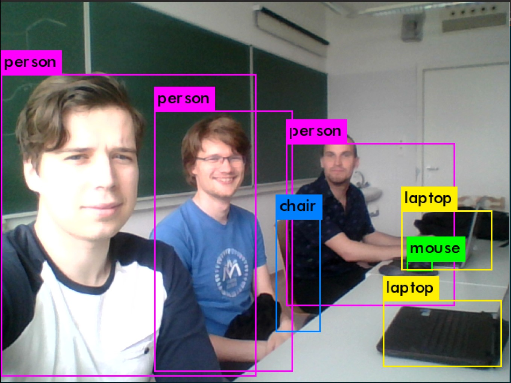

# Real-time-object-detection
ELTE TTK Deep Learning Seminar 2019/Spring

### Project details
The project aims to experiment with real-time object detecting neural networks.
+ First candidate: YOLOv3, Tiny-YOLO with the [Darknet](https://pjreddie.com/darknet/) framework and OpenCV

#### Example screenshot of webcam iamge output, using YOLOv3 with original weights, ~2FPS

